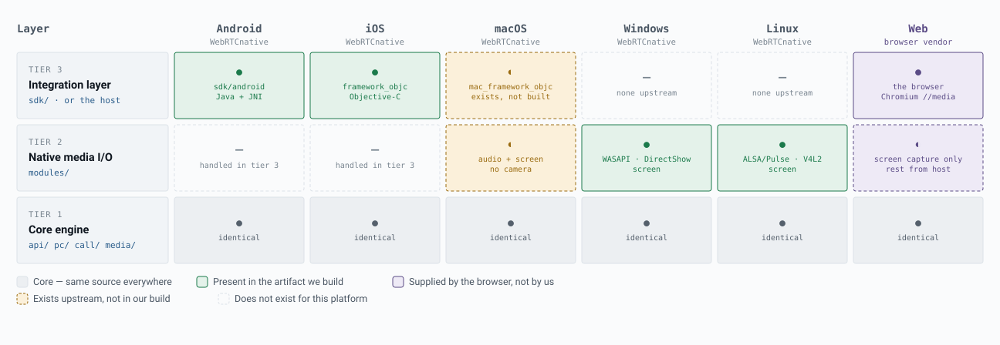
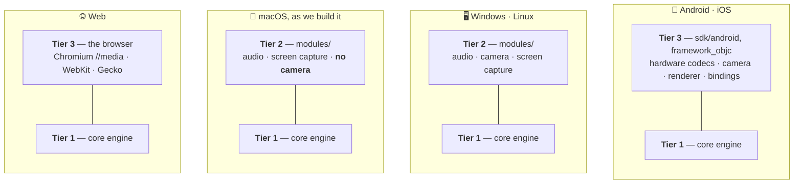

# Platform layers

WebRTC is not one library built six ways. It is a shared C++ core, a native media layer aimed at
desktop, and an integration layer that only some platforms receive. What a platform can do depends
on which of those three reaches it — and on who compiled it.

This page records what is actually inside each artifact, so nobody has to rediscover it by
debugging a null factory at run time.

Everything below was verified against a real `branch-heads/7977` (Chromium M152) checkout and, where
stated, against the compiled Windows output — not from documentation.

## The three layers

| Tier | What it is | Where it lives |
|---|---|---|
| 3 | Integration layer — language bindings, hardware codecs, capture, rendering | `sdk/`, or the host application |
| 2 | Native media I/O — microphone, camera, screen capture | `modules/` |
| 1 | Core engine — transport, RTP, bandwidth estimation, software codecs, APM | `api/`, `pc/`, `call/`, `media/` |

Which layers each platform actually receives:

<picture>
  <source media="(prefers-color-scheme: dark)" srcset="platform-layers-dark.svg">
  
</picture>

Regenerate with `python tools/make_platform_diagram.py` in the main repository after changing the
data; the two SVGs are build output, not hand-edited.

The same thing grouped by the four distinct stack shapes, for anyone who prefers a source form they
can edit in place:



Mobile and the Web sit on tier 3; Windows and Linux sit on tier 2; macOS sits on an incomplete
tier 2 while its tier 3 goes unbuilt. In table form:

| Tier | Android | iOS | macOS | Windows | Linux | Web |
|---|---|---|---|---|---|---|
| 3 Integration | yes | yes | *exists, not built* | none upstream | none upstream | the browser |
| 2 Native media I/O | — | — | partial | yes | yes | screen capture only |
| 1 Core engine | yes | yes | yes | yes | yes | yes |

Tier 2 being blank on mobile is not a gap. Mobile does the same job in tier 3:
`modules/audio_device/` contains `win/`, `mac/` and `linux/` and no mobile directories, because
iOS pulls `sdk:audio_device` instead. Same responsibility, different layer.

## Capability by platform

Native columns describe the artifacts this repository produces today, not WebRTC's full potential.

| Capability | Android | iOS | macOS | Windows | Linux | Web |
|---|---|---|---|---|---|---|
| Transport, RTP, bandwidth estimation | yes | yes | yes | yes | yes | yes |
| VP8 · VP9 · AV1 · Opus | yes | yes | yes | yes | yes | yes |
| Software AEC · NS · AGC | yes | yes | yes | yes | yes | yes |
| Microphone / speaker | SDK | SDK | core | core | core | browser |
| Camera capture | SDK | SDK | **not built** | core | core | browser |
| Screen & window capture | none | none | core | core | core | browser |
| Hardware echo cancellation | yes | yes | none | none | none | browser |
| **H.264** | hardware | hardware | **not built** | **none** | **none** | yes |
| Hardware video encode / decode | MediaCodec | VideoToolbox | **not built** | **none** | **none** | GPU process |
| Video renderer | EGL | Metal | **not built** | **none** | **none** | `<video>` |
| High-level API bindings | Java | Obj-C | **not built** | C++ only | C++ only | JavaScript |

"not built" means WebRTC provides it and this repository does not build it. "none" means it does
not exist for that platform upstream.

## Who builds each platform

| Platform | Compiled by | Artifact | Reaches WebRTCme as |
|---|---|---|---|
| Android | this repository | `libwebrtc.aar` | Java bindings |
| iOS | this repository | `WebRTC.xcframework` | Objective-C bindings |
| macOS | this repository | `libwebrtc.dylib` | P/Invoke |
| Windows | this repository | `webrtc.dll` | P/Invoke |
| Linux | this repository | `libwebrtc.so` | P/Invoke |
| Web | Google · Mozilla · Apple | the browser binary | JSInterop over `RTCPeerConnection` |

Chrome and Edge compile this tree as part of Chromium. Firefox maintains its own embedding —
`build_with_mozilla` guards appear in 9 build files. Safari uses WebKit's fork. There is no wasm or
web target in WebRTC; browsers compile the same C++ natively and expose it through the W3C API,
which is why `WebRTCme.Bindings.Blazor` wraps JavaScript rather than shipping a binary.

## Why desktop is thin

This is upstream's deliberate design, not neglect.

On desktop, WebRTC's consumer is Chrome, which supplies capture, rendering and hardware codecs from
Chromium's own media stack. Building a second one inside WebRTC would be duplicated work that
nobody would use. 133 build files carry `build_with_chromium` conditionals — the browser is not one
more target, it is the one this tree is written for.

The mobile SDKs exist because Google ships them as products to third-party app developers. No
equivalent native desktop SDK was ever needed, so none was written.

The Web column is what the missing tier 3 looks like when someone does build it.

## Three consequences worth knowing

### Desktop has no H.264 — the browser does

One flag separates them:

```
if (build_with_chromium) {
  rtc_use_h264 = media_use_openh264          # the browser gets H.264
} else {
  rtc_use_h264 = proprietary_codecs && ...   # false outside branded Chrome
}
```

So OpenH264 is never compiled into our desktop libraries — confirmed empirically: **0 openh264
objects** in the Windows build. The DLL still exports 26 H.264 symbols for SDP negotiation,
profile-level-id matching and RTP packetization, so the API looks alive, but
`modules/video_coding/codecs/h264/h264.cc:174` is `return nullptr`. Every H.264 factory returns
null.

**Consequence:** desktop peers cannot interoperate over H.264 with Safari, with hardware-only
endpoints, or with SFUs on their H.264 path. Blazor users are unaffected — the browser has it.

Enabling it means setting `proprietary_codecs=true`, which carries MPEG-LA licensing implications
for whoever distributes the result. That is a deliberate decision, not a build tweak.

### macOS is the only self-inflicted gap

WebRTC ships `sdk:mac_framework_objc` with AVFoundation capture, Metal rendering
(`RTCMTLNSVideoView`) and VideoToolbox H.264 — the same completeness as iOS. This repository builds
the raw C++ `webrtc` target instead, so macOS receives none of it.

`modules/video_capture/` contains only `linux/` and `windows/`. There is no `mac/`. **The macOS
`.dylib` has no camera capture path at all.**

Closing this means building `sdk:mac_framework_objc` rather than `webrtc` in
[WebRtcNativeMacOsSharedLib](Workflow-reference), which produces a framework instead of a dylib and
changes how the bindings consume it.

### Screen capture runs the other way

The one capability desktop has and mobile does not. `rtc_desktop_capture_supported` is defined as
Windows, macOS and Linux (with X11 or PipeWire), explicitly excluding mobile. Confirmed: 61
`desktop_capture` objects in the Windows build.

## Verifying this yourself

Against a synced checkout:

```bash
# which platforms have native camera capture
ls modules/video_capture/            # linux, windows -- no mac

# which platforms have a native audio device module
ls modules/audio_device/             # linux, mac, win -- no mobile

# is H.264 compiled in?
find out/Default/obj -path '*openh264*' -name '*.obj' | wc -l    # 0

# what the mobile scripts build
sed -n '41,45p' tools_webrtc/android/build_aar.py
grep -n 'framework_objc' sdk/BUILD.gn
```

## See also

- [Consuming the artifacts](Consuming-the-artifacts) — wiring each artifact into WebRTCme
- [Prebuilt distributions](Prebuilt-distributions) — other projects that build WebRTC
- [Workflow reference](Workflow-reference) — what each workflow builds
